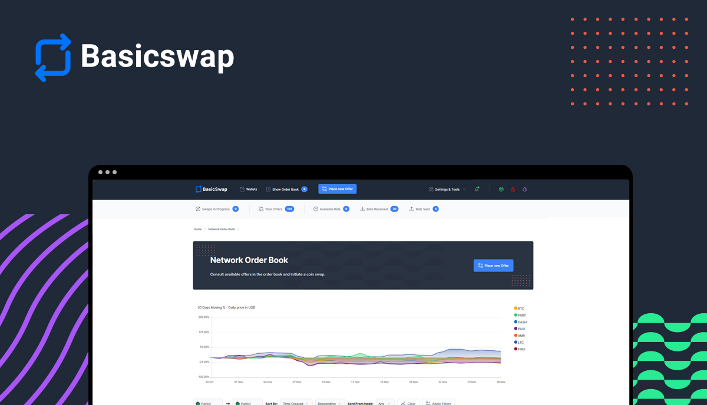

# BasicSwap DEX (BSX)

**[Official Website](https://basicswapdex.com)** | **[News](https://particl.news)** | **[Tutorials](https://academy.particl.io)** | **[Chat]( https://matrix.to/#/#basicswap:matrix.org )**

Table of Contents

* [About](#about)
* [Features](#features)
* [Available Assets](#available-assets)
* [Participate](#participate)
* [Tutorials](#tutorials)
* [License](#license)

## About

**BasicSwap** is the world’s most secure and decentralized DEX. It facilitates cross-chain atomic swaps by enabling peers to interact directly with each other within a free and open environment without central points of failure.

This DEX is fully non-custodial and features a decentralized order book, letting you create or accept swap offers without any fees, counterparties, or the need for accounts.

Built as a low-friction, highly secure solution to the frequent losses of funds on centralized exchanges (e.g., FTX, BitFinex, MtGox), **BasicSwap** aims to provide more reliable and secure cryptocurrency trading conditions for everyone.

**BasicSwap** is currently in active development by the community. While it already offers some of the essential trading features you'd expect from an exchange, more features and quality-of-life improvements are being worked on with the goal to provide a smoother user experience.

## Features

* **True cross-chain support** — Swap cryptocurrencies that live on entirely different blockchain environments, like Bitcoin and Monero.
* **Decentralized order book** — Make or take swap offers on a completely decentralized order book system.
* **No third-party or middleman** — Trade crypto with no intermediaries, completely eliminating central points of failure.
* **No trading fees** — Only pay the typical cryptocurrency network fee.
* **Superior financial privacy** — Protect your financial information from unauthorized access with BasicSwap’s privacy-conscious technology.
* **Full Monero support** — Swap Monero with a variety of other cryptocurrencies like Bitcoin or Particl. No wrapped assets or layer-2 involved.
* **User-friendly interface** — Enjoy all these features within a user-friendly and intuitive interface that handles all the complicated parts for you.

## Under the Hood

**BasicSwap** can be best understood as the decentralized version of the SWIFT messaging network; providing a decentralized messaging protocol that allows for peers to connect directly with each other with the purpose of executing atomic swaps without central points of failure and using official core wallets (Bitcoin Core, Litecoin Core, etc). 

**BasicSwap** does not process, initiate, or execute swaps; it merely enables peers to communicate with each other and exchange the required information to simplify the process of using atomic swaps on the respective blockchains of the coins being swapped. 

In essence, **BasicSwap** operates merely as a decentralized messaging protocol supplemented by a user-friendly interface.

## Available Assets

BasicSwap is compatible with the following digital assets.

<table>
  <tr>
   <td><strong>Coin Name</strong>
   </td>
   <td><strong>Ticker</strong>
   </td>
  </tr>
  <tr>
   <td>Bitcoin
   </td>
   <td>BTC
   </td>
  </tr>
  <tr>
   <td>Monero
   </td>
   <td>XMR
   </td>
  </tr>
  <tr>
   <td>Dash
   </td>
   <td>DASH
   </td>
  </tr>
  <tr>
   <td>Litecoin
   </td>
   <td>LTC
   </td>
  </tr>
  <tr>
   <td>Firo
   </td>
   <td>FIRO
   </td>
  </tr>
  <tr>
   <td>PIVX
   </td>
   <td>PIVX
   </td>
  </tr>
  <tr>
   <td>Decred
   </td>
   <td>DCR
   </td>
  </tr>
  <tr>
   <td>Wownero
   </td>
   <td>WOW
   </td>
  </tr>
  <tr>
   <td>Particl
   </td>
   <td>PART
   </td>
  </tr>
</table>

If you’d like to add a cryptocurrency to BasicSwap, refer to how other cryptocurrencies have been integrated to the DEX by following [this link](https://academy.particl.io/en/latest/basicswap-guides/basicswapguides_apply.html).

# Participate

### Chats

* **For support** Join the community on [#basicswap:matrix.org](https://matrix.to/#/#basicswap:matrix.org) using a Matrix client.

### Documentation, installation

Follow the guides on [Particl Academy](https://academy.particl.io) for tutorials and guides on how BasicSwap works.

* [Download BasicSwapDEX](https://github.com/tecnovert/basicswap/tree/master/doc)

#### Community chat support

* [Matrix](https://matrix.to/#/#basicswap:matrix.org)

# Tutorials

You can find a wide variety of tutorials and step-by-step guides about BasicSwap on the [Particl Academy](https://academy.particl.io) or on Particl’s Youtube channel.

If you encounter an issue or try to accomplish something not mentioned in any of the tutorials included in the links above, please join the community chat support channel; you’ll be sure to find help and support from current contributors there!

# License

BasicSwap is released under MIT software license.
